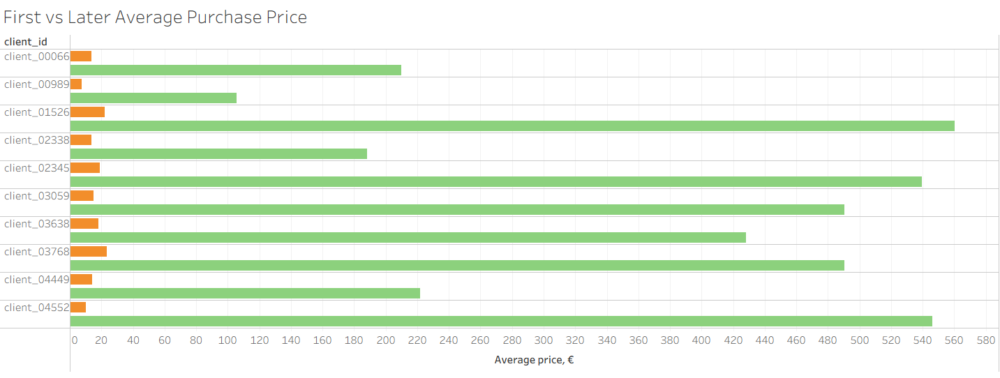
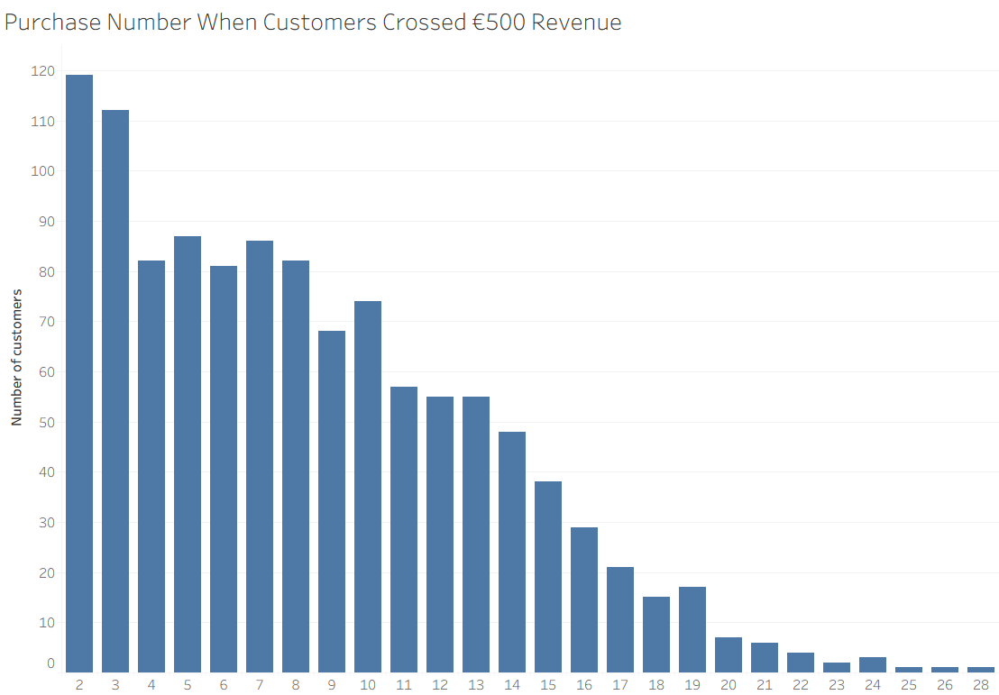
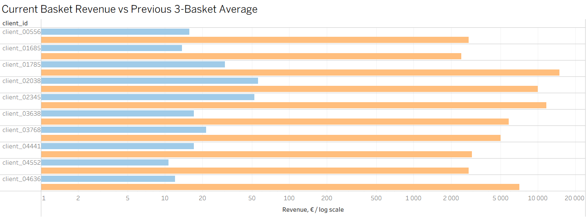
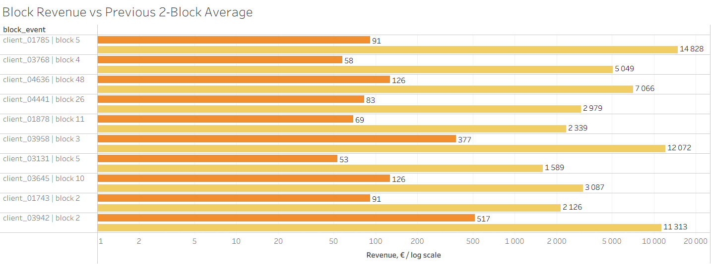

# Customer Spend Progression Analysis

## Project Overview

This project analyzes anonymized real-world e-commerce purchase data to identify customers who become more valuable over time.

The goal is to detect customers whose purchasing behavior changes after the first order: higher basket value, repeated purchases, faster revenue accumulation, or sudden spend uplift.

This type of analysis can support CRM targeting, loyalty campaigns, premium product recommendations, and customer value segmentation.

---

## Business Problem

Not all valuable customers start with a high-value first purchase.

A customer may begin with a small or moderate basket, but later become important for the business through repeated purchases, higher average basket value, or stronger product diversity.

The business question is:

> Which customers show signs of becoming high-value customers over time, and how can we detect this behavior from purchase history?

---

## Tools Used

* SQL / DuckDB
* Python / pandas
* Tableau

---

## Analytical Approach

The analysis was performed at customer and basket level.

Main techniques used:

* Customer-level aggregation
* Basket-level revenue calculation
* First purchase vs later purchase comparison
* Cumulative revenue tracking
* Revenue threshold detection
* Window functions
* Rolling historical baselines
* Spend uplift detection
* Business interpretation of customer behavior

---

## Key Findings


---

# Analysis 1: First Purchase vs Later Behavior

## Business Question

Do some customers become more valuable after their first purchase?

This analysis compares the first purchase with later customer behavior. It checks whether customers increased their average basket value, total revenue, product diversity, and number of repeat purchases after the first purchase.

## SQL Logic

The query separates each customer’s first purchase from later purchases, then compares early and later behavior.

```sql
WITH purchase_baskets AS (
    SELECT
        client_id,
        session_id,
        event_time,
        SUM(price) AS basket_revenue,
        AVG(price) AS basket_avg_price,
        COUNT(DISTINCT product_id) AS basket_products
    FROM events
    WHERE event_type = 'purchase'
      AND product_category = 'wine'
      AND client_id IS NOT NULL
      AND session_id IS NOT NULL
      AND event_time IS NOT NULL
      AND price IS NOT NULL
      AND product_id IS NOT NULL
    GROUP BY client_id, session_id, event_time
),

purchase_order AS (
    SELECT
        client_id,
        session_id,
        event_time,
        basket_revenue,
        basket_avg_price,
        basket_products,
        ROW_NUMBER() OVER (
            PARTITION BY client_id
            ORDER BY event_time ASC
        ) AS purchase_number
    FROM purchase_baskets
),

first_vs_later AS (
    SELECT
        client_id,

        MAX(CASE WHEN purchase_number = 1 THEN basket_revenue END) AS first_basket_revenue,
        MAX(CASE WHEN purchase_number = 1 THEN basket_avg_price END) AS first_basket_avg_price,

        COUNT(CASE WHEN purchase_number > 1 THEN 1 END) AS later_purchases,
        SUM(CASE WHEN purchase_number > 1 THEN basket_revenue ELSE 0 END) AS later_revenue,
        AVG(CASE WHEN purchase_number > 1 THEN basket_avg_price END) AS later_avg_price,
        SUM(CASE WHEN purchase_number > 1 THEN basket_products ELSE 0 END) AS later_products_count,

        AVG(CASE WHEN purchase_number > 1 THEN basket_avg_price END)
            / NULLIF(MAX(CASE WHEN purchase_number = 1 THEN basket_avg_price END), 0)
            AS avg_price_growth_ratio
    FROM purchase_order
    GROUP BY client_id
)

SELECT
    client_id,
    ROUND(first_basket_revenue, 2) AS first_basket_revenue,
    ROUND(first_basket_avg_price, 2) AS first_basket_avg_price,
    later_purchases,
    ROUND(later_revenue, 2) AS later_revenue,
    ROUND(later_avg_price, 2) AS later_avg_price,
    later_products_count,
    ROUND(avg_price_growth_ratio, 4) AS avg_price_growth_ratio
FROM first_vs_later
WHERE later_purchases >= 2
  AND later_revenue >= 300
  AND avg_price_growth_ratio >= 1.3
ORDER BY avg_price_growth_ratio DESC, later_revenue DESC;
```


## Result

| customer_id  | first_purchase_revenue | first_avg_price | later_purchases | later_revenue | later_avg_price | later_distinct_products | avg_price_growth_ratio |
| ------------ | ---------------------: | --------------: | --------------: | ------------: | --------------: | ----------------------: | ---------------------: |
| client_04552 |                  10.00 |           10.00 |              13 |      7,097.40 |          545.95 |                       9 |                54.5954 |
| client_03059 |                  15.00 |           15.00 |              23 |     11,277.00 |          490.30 |                      23 |                32.6870 |
| client_02345 |                  76.00 |           19.00 |              23 |     12,404.60 |          539.33 |                      22 |                28.3858 |
| client_01526 |                  22.00 |           22.00 |              34 |     19,043.00 |          560.09 |                      34 |                25.4586 |
| client_03638 |                  18.00 |           18.00 |              14 |      5,995.10 |          428.22 |                      13 |                23.7901 |
| client_03768 |                  70.00 |           23.33 |              16 |      7,850.00 |          490.63 |                      16 |                21.0268 |
| client_04449 |                  14.00 |           14.00 |              16 |      3,548.00 |          221.75 |                      16 |                15.8393 |
| client_00066 |                  55.00 |           13.75 |              17 |      3,565.00 |          209.71 |                      17 |                15.2513 |
| client_00989 |                  22.00 |            7.33 |               6 |        634.10 |          105.68 |                       6 |                14.4114 |
| client_02338 |                  27.00 |           13.50 |               6 |      1,129.00 |          188.17 |                       6 |                13.9383 |

## Visualization



## Local Conclusion

The analysis shows that several customers started with low or moderate first purchases but later generated much higher purchase value. For example, the strongest cases had later average purchase prices from 13.9x to 54.6x higher than their first purchase average price.

This suggests that first purchase value alone is a weak indicator of long-term customer potential. Some customers who initially look low-value can later become high-value repeat buyers with significantly higher revenue and broader product activity.

However, the highest growth ratios should be interpreted carefully, because very small first purchases can inflate the ratio. For this reason, later revenue, repeat purchase count, and distinct product count should be considered together with the growth ratio.

---

# Analysis 2: High-Value Revenue Threshold Crossing

## Business Question

At what point does a customer become high-value?

This analysis tracks cumulative customer revenue and identifies the purchase where a customer crosses a selected revenue threshold.

The goal is to understand how many purchases it takes for customers to become valuable and whether high-value behavior appears early or only after repeated purchases.

## SQL Logic

The query calculates basket revenue, purchase order number, cumulative revenue, previous cumulative revenue, and the number of days from the first purchase.

```sql
WITH purchase_baskets AS (
    SELECT
        client_id,
        session_id,
        event_time,
        SUM(price) AS basket_revenue
    FROM events
    WHERE event_type = 'purchase'
      AND product_category = 'wine'
      AND client_id IS NOT NULL
      AND session_id IS NOT NULL
      AND event_time IS NOT NULL
      AND price IS NOT NULL
    GROUP BY client_id, session_id, event_time
),

purchase_sequence AS (
    SELECT
        client_id,
        session_id,
        event_time,
        basket_revenue,
        ROW_NUMBER() OVER (
            PARTITION BY client_id
            ORDER BY event_time ASC
        ) AS purchase_number,
        SUM(basket_revenue) OVER (
            PARTITION BY client_id
            ORDER BY event_time ASC
            ROWS BETWEEN UNBOUNDED PRECEDING AND CURRENT ROW
        ) AS cumulative_revenue,
        MIN(event_time) OVER (
            PARTITION BY client_id
        ) AS first_purchase_time
    FROM purchase_baskets
),

threshold_crossing AS (
    SELECT
        client_id,
        session_id,
        event_time,
        purchase_number,
        basket_revenue,
        cumulative_revenue,
        cumulative_revenue - basket_revenue AS previous_cumulative_revenue,
        DATE_DIFF('day', first_purchase_time, event_time) AS days_from_first_purchase
    FROM purchase_sequence
)

SELECT
    client_id,
    session_id,
    event_time,
    purchase_number,
    ROUND(basket_revenue, 2) AS basket_revenue,
    ROUND(cumulative_revenue, 2) AS cumulative_revenue,
    ROUND(previous_cumulative_revenue, 2) AS previous_cumulative_revenue,
    days_from_first_purchase
FROM threshold_crossing
WHERE cumulative_revenue >= 500
  AND previous_cumulative_revenue < 500
  AND purchase_number >= 2
ORDER BY cumulative_revenue DESC;
```

## Result

| customer_id  | purchase_number | basket_revenue | cumulative_revenue | previous_cumulative_revenue | days_from_first_purchase |
| ------------ | --------------: | -------------: | -----------------: | --------------------------: | -----------------------: |
| client_01526 |               3 |      18,518.00 |          18,573.00 |                       55.00 |                        0 |
| client_02345 |               5 |      11,615.00 |          11,847.00 |                      232.00 |                      239 |
| client_03059 |               2 |      10,747.00 |          10,762.00 |                       15.00 |                        0 |
| client_02038 |               4 |       9,920.00 |          10,087.00 |                      167.00 |                        0 |
| client_03342 |               5 |       6,580.00 |           6,930.00 |                      350.00 |                      577 |
| client_03638 |               4 |       5,790.00 |           5,841.00 |                       51.00 |                        0 |
| client_01760 |               3 |       4,435.00 |           4,466.00 |                       31.00 |                      882 |
| client_04568 |               2 |       3,900.00 |           4,215.00 |                      315.00 |                      117 |
| client_04449 |               6 |       3,149.00 |           3,361.00 |                      212.00 |                      208 |
| client_03401 |               2 |       3,190.00 |           3,215.00 |                       25.00 |                        0 |
| client_00066 |               3 |       3,120.00 |           3,202.00 |                       82.00 |                       31 |
| client_00481 |               2 |       2,850.00 |           2,899.00 |                       49.00 |                      331 |
| client_00556 |               5 |       2,767.00 |           2,879.00 |                      112.00 |                        0 |
| client_04552 |               4 |       2,770.00 |           2,801.80 |                       31.80 |                       89 |
| client_03768 |               3 |       2,600.00 |           2,705.00 |                      105.00 |                        0 |
| client_01942 |               2 |       2,670.00 |           2,703.00 |                       33.00 |                      390 |
| client_02340 |               2 |       2,315.00 |           2,685.00 |                      370.00 |                      516 |
| client_02656 |               2 |       2,575.00 |           2,613.00 |                       38.00 |                        6 |
| client_01880 |               2 |       2,420.00 |           2,585.00 |                      165.00 |                        0 |
| client_00598 |              10 |       2,060.00 |           2,528.00 |                      468.00 |                      514 |

## Visualization



## Local Conclusion

The chart shows that most customers who crossed the €500 cumulative revenue threshold did so relatively early, especially on the 2nd and 3rd purchase. The number of new threshold crossings gradually declines as purchase number increases, although a long tail of later crossings still exists.

This suggests that early repeat purchases are an important signal for identifying customers with high-value potential. Customers who approach or cross the threshold within the first few purchases may be strong candidates for CRM follow-up, loyalty actions, or premium product recommendations.

The result table adds another layer: in many top cases, the threshold was crossed through a single large basket after relatively low previous cumulative revenue. Therefore, the business should distinguish between customers who become high-value gradually and customers who cross the threshold suddenly due to one premium purchase.

The first purchase is excluded from this analysis because the goal is to detect customers who became high-value after repeated purchase behavior, not customers who were already high-value from the first order.
---

# Analysis 3: Spend Uplift Detection

## Business Question

Which customers suddenly increased their basket value compared to their own previous behavior?

This analysis detects spend uplift by comparing each basket against the customer’s previous basket history.

Instead of comparing customers to the global average, the query compares each customer against their own historical baseline.

## SQL Logic

The query uses window functions to calculate previous basket revenue, rolling average basket revenue, rolling maximum basket revenue, and spend uplift ratio.

```sql
[INSERT SHORT SQL SNIPPET HERE]

-- Recommended snippet:
-- LAG(previous purchase time)
-- LAG(previous basket revenue)
-- AVG(basket_revenue) over previous 3 baskets
-- MAX(basket_revenue) over previous 3 baskets
-- stake_jump_ratio
```

Full query: [`sql/03_spend_uplift_detection.sql`](sql/03_spend_uplift_detection.sql)

## Result

[INSERT RESULT TABLE HERE]

Recommended columns:

| customer_id  | purchase_number | basket_revenue | avg_previous_3_basket_revenue | max_previous_3_basket_revenue | stake_jump_ratio | days_since_last_purchase |
| ------------ | --------------: | -------------: | ----------------------------: | ----------------------------: | ---------------: | -----------------------: |
| customer_001 |         [value] |        [value] |                       [value] |                       [value] |          [value] |                  [value] |

## Visualization



## Local Conclusion

[INSERT LOCAL CONCLUSION HERE]

Example:

The spend uplift logic highlights customers whose current basket is significantly larger than their own recent baseline. These customers may be strong candidates for premium offers, loyalty actions, or personalized recommendations.

---

# Optional Analysis 4: Spend Rhythm Break by Purchase Blocks

## Business Question

Can customer spend growth be detected more reliably by grouping purchases into blocks?

Single baskets can be noisy. This optional analysis groups customer purchases into blocks of three and compares each block against previous blocks.

This gives a more stable view of customer value progression.

## SQL Logic

```sql
[INSERT SHORT SQL SNIPPET HERE]

-- Recommended snippet:
-- FLOOR((ROW_NUMBER() - 1) / 3) AS block
-- block-level revenue
-- previous block revenue
-- rolling average of previous blocks
-- block_jump_ratio
```

Full query: [`sql/04_spend_rhythm_by_blocks.sql`](sql/04_spend_rhythm_by_blocks.sql)

## Result

[INSERT RESULT TABLE HERE]

Recommended columns:

| customer_id  |   block | block_purchases | block_revenue | avg_previous_2_blocks_revenue | block_jump_ratio | days_since_last_block |
| ------------ | ------: | --------------: | ------------: | ----------------------------: | ---------------: | --------------------: |
| customer_001 | [value] |         [value] |       [value] |                       [value] |          [value] |               [value] |

## Visualization



## Local Conclusion

[INSERT LOCAL CONCLUSION HERE]

Example:

Block-level analysis reduces the noise of individual baskets and shows broader shifts in customer behavior. This is useful when the business wants to detect sustained value growth rather than isolated high-value purchases.

---

# Overall Business Conclusion

[INSERT FINAL CONCLUSION HERE]

Example:

The analysis shows that customer value progression cannot be understood only from the first purchase. Some customers start with moderate baskets but later become high-value through repeat purchases, higher basket value, or sudden spend uplift.

From a business perspective, these customers are important because they may be missed by simple first-order segmentation. Tracking cumulative revenue, purchase number, spend uplift, and basket progression can help the business identify customers suitable for CRM campaigns, loyalty incentives, premium recommendations, and retention actions.

---

# Business Recommendations

[INSERT 3–5 RECOMMENDATIONS HERE]

Example:

* Track customers whose later basket value grows significantly compared to their first purchase.
* Create a CRM segment for customers approaching the high-value revenue threshold.
* Monitor sudden spend uplift as a signal for premium product interest.
* Use customer-level spend progression as an input for recommendation and loyalty campaigns.
* Avoid judging long-term customer value only by the first purchase.

---

# Limitations

* The dataset contains anonymized historical purchase data.
* Raw commercial data is not included in this repository.
* The analysis is based on observed purchase behavior, not full customer intent.
* The project does not include marketing exposure, acquisition channel, or customer demographics.
* Revenue thresholds are analytical assumptions and should be adjusted based on real business context.
* The analysis identifies behavioral patterns but does not prove causality.

---

# Project Structure

```text
customer-spend-progression-analysis/
│
├── README.md
├── sql/
│   ├── 01_first_vs_later_behavior.sql
│   ├── 02_high_value_threshold_crossing.sql
│   ├── 03_spend_uplift_detection.sql
│   └── 04_spend_rhythm_by_blocks.sql
│
├── images/
│   ├── first_vs_later_revenue.png
│   ├── high_value_threshold_crossing.png
│   ├── spend_uplift_detection.png
│   └── spend_rhythm_by_blocks.png
│
├── notebooks/
│   └── analysis_validation.ipynb
│
└── data_sample/
    └── anonymized_sample.csv
```

---

# Skills Demonstrated

* SQL data analysis
* Customer-level segmentation
* Basket-level revenue analysis
* Window functions
* Cumulative revenue tracking
* Rolling baseline calculation
* Business KPI interpretation
* Data anonymization awareness
* Analytical storytelling
* Portfolio-ready documentation

---

# Summary

This project demonstrates how SQL can be used to identify customer value progression in real-world e-commerce purchase data.

The analysis focuses on customers who become more valuable over time, cross high-value revenue thresholds, or show sudden spend uplift compared to their own previous behavior.

The main business value is the ability to support CRM, retention, loyalty, and recommendation strategies with customer-level behavioral analysis.
